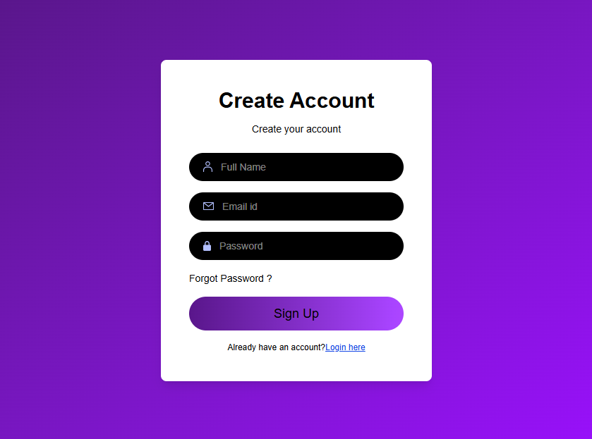
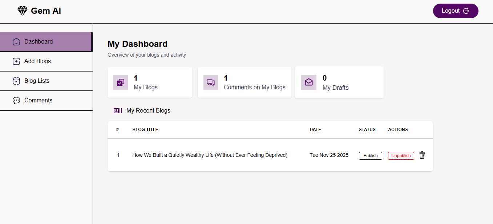
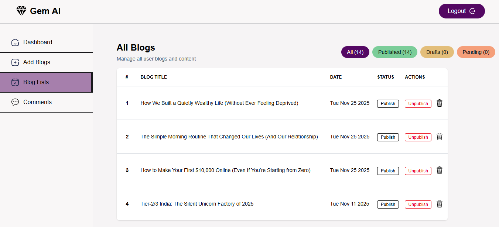

# 🌟 Gem AI – Intelligent Blogging Platform

A comprehensive **full-stack AI-powered blogging platform** designed to deliver an enterprise-grade content creation and management experience. Built using the **MERN stack**, Gem AI offers secure authentication, admin-level moderation tools, rich text publishing, user analytics, and an elegant UI/UX optimized for creators.


---

## 📌 Table of Contents
- [Features](#-features)
- [Tech Stack](#-tech-stack)
- [Getting Started](#-getting-started)
- [Project Structure](#-project-structure)
- [Usage](#-usage)
- [Security Features](#-security-features)
- [Deployment](#-deployment)
- [Contributing](#-contributing)
- [Screenshots](#-screenshots)
- [Author](#-author)
- [Acknowledgments](#-acknowledgments)
- [Support](#-support)

---

## 🛡️ Badges

<p align="left">
  
  
  
  
  
  
</p>

---

## 🌟 Features

### Core Capabilities
- **Secure Authentication System** (JWT, bcrypt, OTP email verification)
- **Rich Text Markdown Editor** (Quill + Markdown rendering)
- **Comprehensive Analytics Dashboard**
- **Admin Moderation Panel**
- **User Commenting & Engagement System**

### Authentication & Security
- JWT-based protected routes  
- Email verification using Nodemailer  
- Encrypted user data with bcryptjs  
- Fully secure HTTP-only cookies  
- Protected admin routes  
- CORS & input validation  

### Content Management
- Professional editor with autosave  
- Real-time preview  
- Draft and version management  
- ImageKit CDN integration  

### Admin Tools
- Role-based access control (RBAC)  
- Blog approval/rejection system  
- Comment moderation  
- User activity audits  

### User Dashboard
- Blog analytics  
- Engagement insights  
- Draft management  
- Activity overview  

### Modern UI/UX
- Responsive TailwindCSS design  
- Lucide-React icons  
- Smooth animations  
- Toast notifications  

---

## 🛠️ Tech Stack

### Frontend


### Backend


Other Libraries:
- Axios  
- Quill  
- Marked  
- Moment.js  
- bcryptjs  
- JWT  
- Nodemailer  
- Multer  
- ImageKit  
- Cookie Parser  

---

## 🚀 Getting Started

### Prerequisites
- Node.js (v14+)
- MongoDB Atlas
- ImageKit account
- SMTP email credentials

### Installation

Clone Project:
```bash
git clone https://github.com/vedant0706/Gem-AI.git
cd Gem-AI
Install Server:

bash
Copy code
cd server
npm install
Install Client:

bash
Copy code
cd client
npm install
Set up environment files for both client and server (example included in your original README).

Run the app:

Server:

bash
Copy code
npm start
Client:

bash
Copy code
npm run dev


📁 Project Structure
GEM AI/
├── client/
│   ├── src/
│   │   ├── assets/
│   │   │   ├── git_banner_gemai.png
│   │   │   ├── login_page.png
│   │   │   ├── dashboard_page.png
│   │   │   └── admin_blog_page.png
│   ├── public/
│   ├── package.json
│   └── ...
│
├── server/
│   ├── config/
│   ├── controllers/
│   ├── models/
│   ├── routes/
│   ├── package.json
│   └── server.js
│
└── README.md
```

🎯 Usage
### Users
- Sign up with email verification
- Create and Delete blogs
- Save drafts
- Comment on content
- Track analytics
  

### Admin
- Approve/reject posts
- Manage comments
- Access user activity logs
  

### 🔒 Security Features
- JWT authentication
- Secure password hashing
- HTTP-only cookies
- Role-based authorization
- OTP verification
- Sanitized inputs
  

### 🌐 Deployment
- Frontend – Vercel
- bash
- Copy code
- vercel deploy --prod
- Backend – Vercel
- Follow provider instructions.
  

### 🤝 Contributing
- We welcome contributions!
- Here's the simple version:
- Fork the project
- Create a new branch
  

```
bash
Copy code
git checkout -b feature/YourFeatureName
Make your changes

Commit

bash
Copy code
git commit -m "Add: YourFeatureName"
Push

bash
Copy code
git push origin feature/YourFeatureName
Open a Pull Request
```

### 🖼️ Screenshots


- Login Page scrennshot


- Dashboard screenshot


- Blog Editor screenshot



### 👨‍💻 Author
Vedant Jadhav

GitHub: https://github.com/vedant0706

LinkedIn: https://www.linkedin.com/in/vedant-jadhav-0b1947340

Portfolio: https://jadhavvedant.vercel.app

### 🙏 Acknowledgments
- React community
- MongoDB documentation
- TailwindCSS
- Open-source contributors

### 📞 Support
For support, email: vedantjadhav173@gmail.com
Or open an issue on GitHub.

### 🌐 Live Demo
🔗 https://gemai-client.vercel.app


<p align="center">Made with ❤️ by <b>Vedant Jadhav</b></p>
